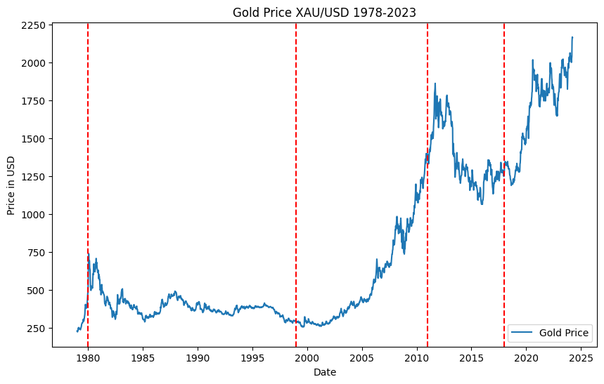

# Gold CTA Strategy

## Background

### Background of Gold Prices Over Seven Decades

Gold prices have seen significant fluctuations over the past decades, influenced by a myriad of economic and political events.

### 1944-1971: Post-War Stability and the Bretton Woods System
Post-WWII, gold prices were stable due to the Bretton Woods System pegging currencies to gold. The system collapsed in 1971, leading to more market-driven gold pricing.

### 1971-1979: Stagflation and Rapid Price Increases
With the end of the Bretton Woods System, gold prices increased dramatically, exacerbated by the oil crisis and inflation. Prices peaked in 1980 due to high interest rates and economic interventions.

### 1980-1999: Market Liberalization and Price Stabilization
During this period, gold prices stabilized, experiencing a gradual decline. Despite economic turbulence, such as the 1987 Black Monday, gold did not see major price spikes.

### 2000-2011: Economic Uncertainty and Price Surges
The dot-com bubble burst and the 2008 financial crisis led to a surge in gold prices as investors sought safe-haven assets. Gold prices hit record highs in 2011.

### 2012-2018: Market Recovery and Price Corrections
After reaching a peak in 2011, gold prices corrected as the economy recovered. However, monetary easing policies kept prices relatively high.

### Post-2018: Increased Volatility and Pandemic Impact
In 2018, gold prices began to climb again due to global economic uncertainties and trade tensions. The COVID-19 pandemic further increased gold's appeal as a safe asset, pushing prices to new highs by 2020.

Overall, gold prices have been influenced by global economic conditions, monetary policies, and crisis events, reflecting its status as a safe-haven investment during times of uncertainty.

