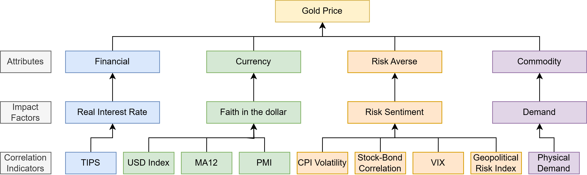

# Gold CTA Strategy

## Project Objective
This project focuses on constructing a systematic Gold CTA strategy by analyzing the historical drivers of gold price fluctuations and implementing key quantitative models. Gold, as both a commodity and financial asset, exhibits unique price dynamics influenced by a range of macroeconomic and market factors. 

This project integrates the timing results based on gold’s four major attributes and various indicators, ultimately selecting the win rate, Sharpe ratio, and excess return as evaluation criteria from each attribute. The nine timing indicators are as follows: U.S. 10-Year Real Yield Index (TIPS), U.S. CPI Volatility, U.S. Dollar Index, U.S. ISM Manufacturing PMI, U.S. Fiscal Deficit, Bond-Equity Correlation, VIX Volatility Index, Geopolitical Risk Index, and Physical Gold Demand.

Starting from four dimensions, this paper constructs a timing framework for gold assets:
- Financial Attribute – Gold, as an investable asset, has no interest payments, making the market’s real interest rate the opportunity cost of holding gold.
- Currency Attribute – Gold’s long-term reserve function positions it as a substitute for the U.S. dollar. Gold is directly priced in dollars, and under the current monetary system, a weakening dollar increases demand for gold, driving up its price.
- Hedging Attribute – Gold serves as a hedging asset. During periods of heightened geopolitical events and financial risks, gold often acts as a store of value.
- Commodity Attribute – Gold can be processed into jewelry, bars, coins, and other consumer or collectible products. Its price is influenced by both supply and demand factors.
  

## Framework Description for Timing Gold Selection

Due to the multifaceted nature of gold, each attribute performs differently over time, leading to varying impacts on gold prices. This paper adopts a timing measurement framework based on different indicators corresponding to the four attributes of gold. The framework evaluates the performance of gold under various attributes, assessing returns, excess returns, and risk-adjusted returns. A single indicator is calculated as the weighted composite score to determine the total timing signal for gold selection.

- Rebalancing Frequency: Monthly.
- Rebalancing Date: To ensure data consistency and avoid future data bias, indicators use real-time values as of the end of the prior month.
- Time Period: January 2010 – December 2023.
- Target Assets: London Gold
- Selection Signal Setting: Based on multiple indicators aligned with gold’s attributes.
- Performance Evaluation Metrics: Returns, excess returns, Sharpe ratios, and overall risk-adjusted performance are used to assess timing strategies.

## Background

### Role of Gold as a Dual Asset
Gold serves as both a commodity and a financial asset, fulfilling critical roles in risk hedging, inflation protection, and portfolio diversification. Its price dynamics are shaped by a combination of macroeconomic factors, including international monetary policy shifts, currency exchange rates, and geopolitical stability. As a result, gold remains a unique investment vehicle that reacts dynamically to both economic fundamentals and market sentiment.

1970s Era: The collapse of the Bretton Woods system in the 1970s initiated a period of rising gold prices. Inflation expectations became a dominant factor during this time, driving gold price fluctuations.

1980–2000 Period: From 1979 to 2000, inflation expectations remained the primary determinant of gold prices, showing a strong correlation with international gold stock. During this period, the monthly correlation coefficient between gold prices and inflation expectations was 56.48%. However, after a surge in inflation-driven gold prices between 1980–1990, real gold prices experienced a significant drop, revealing a divergence from inflation expectations.

Post-2000 Developments: The relationship between gold prices and inflation expectations weakened after 2000. With the introduction of gold ETFs and the increasing financialization of gold markets, real interest rates emerged as the most significant driver of gold price trends. Notably, from 2003 onwards, the correlation between international gold prices and real interest rates became strongly negative (-72.66%), highlighting the role of inflation-adjusted bond yields in shaping gold price movements.

